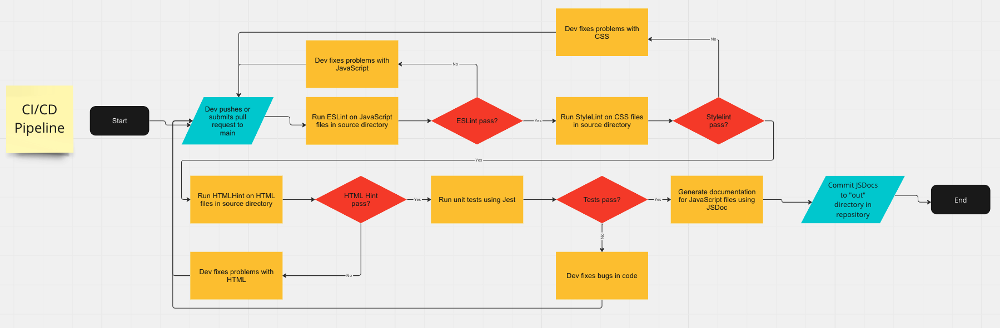

# CI/CD Pipeline Phase 1

**Team 3:** Powell's Pride Tech

## What is currently functional:

When someone pushes or makes a pull request to the `main` branch, the pipeline runs linting software (ESLint, Stylelint, HTMLHint) on the JavaScript, CSS, and HTML files respectively. It then runs the unit tests using Jest and generates documentation using JSDoc. 

## Step-By-Step breakdown of current pipeline:

* `name: CI`: The name of the workflow, "CI".
* `on: push: branches: - main`: This specifies that the workflow should be triggered whenever there's a push to the main branch.
* `pull_request: branches: - main`: This also triggers the workflow whenever a pull request is created targeting the `main` branch.
* `jobs: build:`: This begins the definition of a job called `build`. Each job runs in a separate environment.
* `runs-on: ubuntu-latest`: This specifies that the job should run on the latest Ubuntu virtual environment provided by GitHub.
* `- uses: actions/checkout@v2`: This step checks out your repository's code onto the runner (the virtual environment).
* `- name: Use Node.js`: This step sets up Node.js environment in the runner. It uses the `actions/setup-node@v2` action for this.
* `- name: Cache node modules`: This step caches your dependencies to speed up installation in future runs. It uses the `actions/cache@v2` action.
* `- name: Install dependencies`: This step installs your dependencies using `npm ci`.
* `- name: StandardJS and Prettier`: This step runs ESLint on your JS files in the `source` directory.
* `- name: Stylelint`: This step runs Stylelint on your CSS files in the `source` directory.
* `- name: HTMLHint`: This step runs HTMLHint on your HTML files in the `source` directory.
* `- name: Jest (optional)`: This step runs Jest to execute your tests. If Jest fails, it sets an output variable `status` to `failure`.
* `- name: JSDoc`: This step generates documentation from your JS files using JSDoc.
* `- name: Commit JSDoc changes`: This step commits any changes made by JSDoc and pushes them to your repository. It first sets the user name and email for Git, then adds all changes, commits them with the message "Update JSDoc", and finally pushes the changes to your repository using the `GITHUB_TOKEN` for authentication.

## Diagram of Pipeline:

## Future Plans

These are some features we are considering adding in the future:

* more advanced code checker such as Codeclimate or Codacity
* minification before deploying to production
* code coverage analysis (measures percentage of code covered by unit tests, to help identify untested code)
* assess site performance using Lighthouse (it has a Node command line tool)
* accessibility testing
* testing in multiple browsers using selenium
