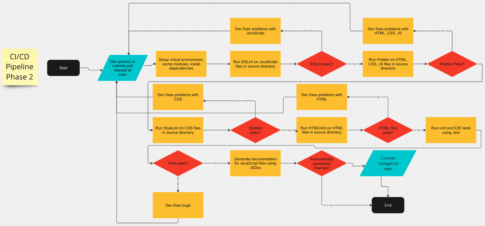

# CI/CD Pipeline Phase 2

**Team 3:** Powell's Pride Tech

## What is currently functional:

When someone pushes or makes a pull request to the `main` branch, the pipeline runs linting software (ESLint, Prettier, Stylelint, HTMLHint) on the JavaScript, CSS, and HTML files. If the linting fails, feedback on why it failed is provided in GitHub. The linters (except HTMLHint) automatically fix style issues if they can. After linting, the workflow runs the unit tests and E2E tests using Jest and Puppeteer. Next, the workflow generates documentation using JSDoc. The JSDoc documentation and any style fixes are commmitted and pushed to the repo if any changes have been made. The workflow caches the tools used so they do not have to be installed each time.

## How to use the CI/CD Pipeline:

1. Simply push code to the `main` branch or create a pull request to merge a branch to the `main` branch in order to run the pipeline.
2. Results from the run can be viewed in the "Actions" tab by clicking the failed run and clicking "build" in the left sidebar.

## Step-By-Step breakdown of current pipeline:

* `name: CI`: The name of the workflow, "CI".
* `on: push: branches: - main`: This specifies that the workflow should be triggered whenever there's a push to the main branch.
* `pull_request: branches: - main`: This also triggers the workflow whenever a pull request is created or updated targeting the `main` branch.
* `jobs: build:`: This begins the definition of a job called `build`. Each job runs in a separate environment.
* `runs-on: ubuntu-latest`: This specifies that the job should run on the latest Ubuntu virtual environment provided by GitHub.
* `- uses: actions/checkout@v3`: This step checks out your repository's code onto the runner (the virtual environment).
* `- name: Use Node.js`: This step sets up Node.js environment in the runner. It uses the `actions/setup-node@v3` action for this.
* `- name: Cache node modules`: This step caches your dependencies to speed up installation in future runs. It uses the `actions/cache@v3` action. Cache files are stored in `~/.npm` on Linux/macOS.
* `name: List the state of node modules`: This step checks if the cache was successfully retrieved or not. If not, it lists the state of the node modules.
* `- name: Install dependencies`: This step installs your dependencies using `npm install`.
* `- name: ESLint and Prettier`: This step runs ESLint on your JS files and Prettier on your JS, CSS, and HTML files in the `source` directory. If style issues can be automatically fixed, they are. 
* `- name: Stylelint`: This step runs Stylelint on your CSS files in the `source` directory. If style issues can be automatically fixed, they are.
* `- name: HTMLHint`: This step runs HTMLHint on your HTML files in the `source` directory.
* `- name: Jest`: This step runs Jest to execute E2E and unit tests.
* `- name: JSDoc`: This step generates documentation from your JS files using JSDoc.
* `- name: Check for changes`: This step checks for any changes that may need to be committed (e.g. style fixes from linters, updates to JSDocs). It uses the `UnicornGlobal/has-changes-action@v1.0.11` action.
* `- name: Commit JSDoc changes`: This step commits any changes made by JSDoc or the linters and pushes them to your repository. It first sets the user name and email for Git, then adds all changes, commits them with the message "Automatically fix style issues and add new JSDocs", and finally pushes the changes to your repository using the `GITHUB_TOKEN` for authentication.

## Diagram of Pipeline:

## Future Plans

These are some features we are considering adding in the future. None of the tools listed here are finalized yet.

* more advanced code checker such as Codeclimate or Codacity
* minification before deploying to production
  * **HTML Minifiers:** HTMLMinifier, Terser HTML
  * **CSS Minifiers:** UglifyCSS, Clean-css
  * **JavaScript Minifiers:** UglifyJS, Terser
  * **Image Minifiers:** imagemin, MozJPEG
* code coverage analysis (measures percentage of code covered by unit tests, to help identify untested code)
  * Istanbul (https://istanbul.js.org/docs/tutorials/jest/) is built into Jest, which we are already using so it might be a good option for coverage analysis
* assess site performance using Lighthouse or WebPageTest
  * Lighthouse is free
  * Need to pay for WebPageTest to use integrations
* accessibility testing (Pa11y)
* testing in multiple browsers using selenium
* integration testing (can use Jest)
