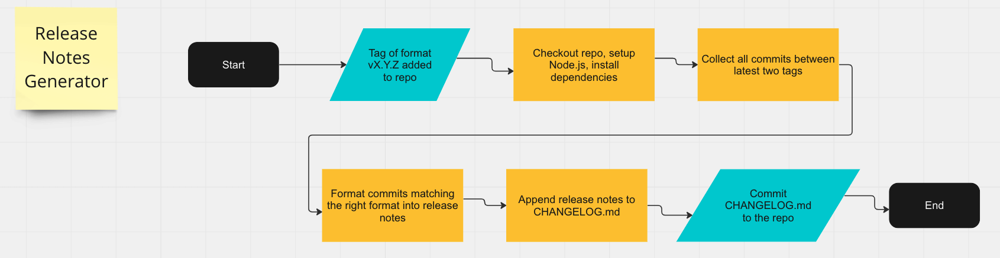

# Release Notes Generator Documentation

**Team 3:** Powell's Pride Tech

## What is currently functional:

The release notes generator runs whenever a tag is pushed to the `main` branch, specifying the SemVer version of the app being released. The release notes generator collects data from all the commit messages since the last release and formats them into release notes. Commit messages must be in one of the following formats:

`fix: <commit message detailing a bug fix>`

`feat: <commit message detailing a new feature>`

`docs: <commit message detailing changes to documentation>`

Commmits not following one of the above formats are not included in the release notes. The release notes are generated and appended to the bottom of `CHANGELOG.md`. 

## How to use the release notes generator:

When committing changes to the repository on any branch, if you would like your commit message to be included in the release notes, please format your commit message in one of the following formats:

`fix: <commit message detailing a bug fix>`

`feat: <commit message detailing a new feature>`

`docs: <commit message detailing changes to documentation>`

Any text in the commit messages to the right of the `:` will be included in the release notes. Commit messages starting with `fix:` will be preceded by "**Bug Fix:**" in the release notes. Commit messages starting with `feat:` will be preceded by "**Feature:**" and commit messages starting with `docs:` will be preceded by "**Documentation:**". 

When a new version of the app is ready to be released, simply tag the latest commit for that version of the app with the SemVer version number of the app being released. For example, you can use `git tag vX.Y.Z` followed by `git push --tag` to create the tag and push it to GitHub. (Be sure to create the tag in the `main` branch. If you need to merge another branch to `main` to do the release, perform the merge first, then create the tag.) The release notes will automatically be generated using commits that occurred between the commit with the latest tag and the commit with the second-to-latest tag. The release notes will be visible at the bottom of `CHANGELOG.md` in the root of the repo.

## Step-By-Step breakdown of release notes generator:

* `on: create: tags: - 'v[0-9]+.[0-9]+.[0-9]+' branches: - main`: This GitHub action runs whenever a tag is created in the main branch in SemVer format.
* `jobs: release: runs-on: ubuntu-latest`: This creates a job called `release` which runs on a virtual environment. The virtual environment uses the latest version of Ubuntu supported by GitHub actions.
* `name: Checkout repository`: This step checks out the repository to the virtual environment using the action `actions/checkout@v2`. Setting `fetch-depth: 0` ensures that all tags and commit history are checked out, allowing the release notes generator to generate release notes using all commits between the latest two tags.
* `- name: Set up Node.js`: This step sets up Node.js version 14 using `actions/setup-node@v2`.
* `- name: Install dependencies`: This step installs dependencies using `npm install`.
* `- name: Generate Release Notes and Update CHANGELOG`: This step collects all commit messages between the latest two tags and formats them into release notes. It then appends the formatted release notes to `CHANGELOG.md`.
* `- name: Commit changes`: This step commits the newly generated release notes to the repo.

## Diagram of Release Notes Generator:

## Future Plans:

* create a specific format for commit messages to be excluded from release notes, rather than excluding any commit that does not follow the format
* group all `fix:` commits under one header, all `feat:` commits under one header, and all `docs:` commits under one header in the release notes rather than appending them mixed up to `CHANGELOG.md`
* append release notes for new versions of the app to the top of `CHANGELOG.md`, rather than the bottom
